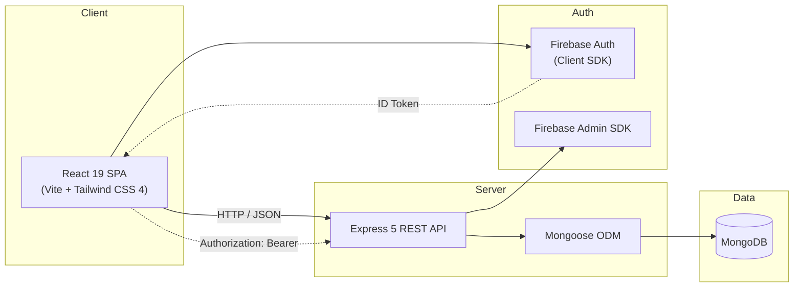

<p align="center">
  
</p>

<h1 align="center">RUET OBE Evaluation System</h1>

<p align="center">
  A comprehensive Outcome-Based Education evaluation platform built for<br/>
  <strong>Rajshahi University of Engineering &amp; Technology (RUET)</strong>
</p>

<p align="center">
  
  
  
  
  
  
</p>

---

## Overview

The **RUET OBE Evaluation System** digitises the entire Outcome-Based Education workflow — from course-outcome mapping and assessment creation to OBE attainment analytics and feedback collection. It provides role-specific dashboards for university administrators, department heads, teachers, and students, enabling transparent and data-driven academic evaluation.

> **Live Demo:** [obe-webapp-demo.netlify.app](https://obe-webapp-demo.netlify.app)

---

## Key Features

| Area | Highlights |
|------|------------|
| **Role-Based Dashboards** | Dedicated panels for Central Admin, Department Admin, Teacher, and Student |
| **Course & CO/PO Mapping** | Define Course Outcomes, map to Program Outcomes, track attainment |
| **Assessment Engine** | Create theory & sessional assessments with per-CO mark distribution |
| **OBE Attainment Analytics** | Automatic CO/PO attainment calculations with visual reports |
| **Grading & Marksheets** | Semester-final grading, student marksheet generation |
| **Attendance Tracking** | Per-class attendance with summary analytics |
| **Feedback System** | Student-submitted and instructor self-assessment course feedback |
| **Course Review Hub** | Gap analysis comparing student vs. instructor feedback |
| **Instructor Experience Reports** | Teachers submit structured teaching experience reports |
| **Notice Board** | Department-level and course-level notices with read tracking |
| **Course Advisor Management** | Assign course advisors, manage student sections |
| **Export** | Excel (`.xlsx`) and PDF report generation |
| **PWA Support** | Installable as a Progressive Web App on mobile and desktop |
| **Dark Mode** | System-wide dark theme toggle |

---

## Architecture



---

## User Roles

| Role | Dashboard Route | Capabilities |
|------|----------------|--------------|
| **Central Admin** | `/central-admin` | University-wide overview, department & teacher management, student management, course management, series management |
| **Dept Admin** | `/dept-admin` | Department courses, teacher assignment, course advisor management, department notices, course review hub, feedback analytics |
| **Teacher** | `/teacher` | Class management, assessment creation & grading, CO management, attendance, evaluation reports, instructor experience reports, section CR management, student roster, notices |
| **Student** | `/student` | Enrolled courses, marksheets, OBE attainment, attendance info, course feedback submission, notice board, university directory |

---

## Project Structure

```
obe-webapp/
├── frontend/              # React 19 single-page application
│   ├── public/            # Static assets, PWA manifest, service worker
│   └── src/
│       ├── components/    # Shared UI components (Layout, Sidebar, ProtectedRoute)
│       ├── config/        # Firebase & API configuration
│       ├── contexts/      # React contexts (Auth, Theme, Sidebar)
│       ├── hooks/         # Custom hooks
│       ├── pages/         # Role-based page modules
│       │   ├── admin/     # Central Admin pages
│       │   ├── dept-admin/# Department Admin pages
│       │   ├── teacher/   # Teacher pages
│       │   ├── student/   # Student pages
│       │   └── notices/   # Notice board pages
│       ├── store/         # Redux Toolkit store, slices & RTK Query
│       └── utils/         # Utility functions (API, export, grading)
│
├── backend/               # Express 5 REST API
│   ├── config/            # Firebase Admin SDK initialisation
│   ├── middleware/        # JWT auth middleware
│   ├── models/            # Mongoose schemas (13 models)
│   ├── routes/            # Express route handlers (13 modules)
│   ├── services/          # Business logic (analytics, OBE engine, notifications)
│   └── utils/             # Shared helpers
│
├── ece-courses.json       # ECE department course seed data
├── ruet_teachers.json     # RUET teacher seed data
└── RUET_ECE_2023_students.csv  # ECE 2023 student roster
```

---

## Quick Start

### Prerequisites

| Dependency | Minimum Version |
|-----------|----------------|
| **Node.js** | 18+ |
| **npm** | 9+ |
| **MongoDB** | 6+ (local) or MongoDB Atlas |
| **Firebase Project** | With Authentication enabled |

### 1. Clone the Repository

```bash
git clone https://github.com/your-org/obe-webapp.git
cd obe-webapp
```

### 2. Configure Environment Variables

```bash
# Backend
cp backend/.env.example backend/.env
# Edit backend/.env → set MONGO_URI, JWT_SECRET, Firebase credentials, ALLOWED_ORIGINS

# Frontend
cp frontend/.env.example frontend/.env
# Edit frontend/.env → set Firebase client keys and VITE_API_URL
```

See [backend/.env.example](backend/.env.example) and [frontend/.env.example](frontend/.env.example) for all available variables.

### 3. Install Dependencies

```bash
# Backend
cd backend && npm install

# Frontend (in a separate terminal)
cd frontend && npm install
```

### 4. Seed the Database

```bash
cd backend
npm run seed
```

This creates:
- **20 RUET departments** with admins
- **All RUET teachers** (from `ruet_teachers.json`)
- **ECE course catalogue** (from `ece-courses.json`)
- **ECE 2023 student roster** (from `RUET_ECE_2023_students.csv`)

> **Default credentials** (password: `123456`):
> - Central Admin: `admin@obe.ruet.ac.bd`
> - ECE Dept Admin: `admin@ece.ruet.ac.bd`

### 5. Run the Development Servers

```bash
# Backend (http://localhost:5000)
cd backend && npm run dev

# Frontend (http://localhost:5173)
cd frontend && npm run dev
```

---

## Tech Stack

| Layer | Technologies |
|-------|-------------|
| **Frontend** | React 19, Vite 6, Tailwind CSS 4, Redux Toolkit, React Router 7, Lucide Icons |
| **Backend** | Express 5, Mongoose 9, JWT (jsonwebtoken), bcryptjs, express-rate-limit |
| **Authentication** | Firebase Authentication (client SDK + Admin SDK) |
| **Database** | MongoDB (local or Atlas) |
| **Export** | ExcelJS, jsPDF + jspdf-autotable, file-saver, xlsx |
| **DevOps** | Netlify (frontend), Render / Railway (backend), MongoDB Atlas |

---

## Deployment

### Frontend → Netlify

1. Connect your GitHub repo to Netlify
2. **Build command:** `cd frontend && npm run build`
3. **Publish directory:** `frontend/dist`
4. Set environment variables (`VITE_*`) in Netlify dashboard
5. SPA routing is handled by `frontend/public/_redirects`

### Backend → Render / Railway

1. Create a new Web Service pointing to the `backend/` directory
2. **Build command:** `npm install`
3. **Start command:** `npm start`
4. Set environment variables: `MONGO_URI`, `JWT_SECRET`, `FIREBASE_SERVICE_ACCOUNT` (base64), `ALLOWED_ORIGINS`
5. Connect to a MongoDB Atlas cluster for production data

---

## License

This project is licensed under the [ISC License](https://opensource.org/licenses/ISC).

---

## Contributors

Built with ❤️ by ECE students of RUET.
